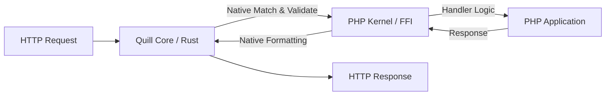

# Quill-Core

[](https://github.com/quillphp/quill-core/actions/workflows/ci.yml)
[](https://github.com/quillphp/quill-core/releases)
[](https://opensource.org/licenses/MIT)
[](https://www.rust-lang.org)

**Quill-Core** is the high-performance, native engine behind the **Quill PHP Framework**. Built with Rust and optimized for sub-microsecond overhead, it offloads the heavy lifting of routing, validation, and JSON processing to a thread-safe, memory-safe library.

---

## Key Features

- **Blazing Fast Routing**: Uses a Radix-tree based router (`matchit`) for O(1) performance in both PHP and CLI modes.
- **Native DTO Validation**: Decouples validation from PHP userland, performing schema checks at native speeds before your code even runs.
- **FFI-First Architecture**: Seamlessly integrates into any PHP environment via the `FFI` extension, with zero build-step requirements for the end user.
- **Cross-Platform**: Automated release pipeline providing pre-built binaries for **Linux** and **macOS** (Intel & Apple Silicon).
- **Efficient JSON Compaction**: Specialized native methods for ultra-fast JSON transformations between boundaries.

---

## Architecture Overview

The Quill Core acts as a high-performance intermediary between the incoming HTTP traffic and your PHP application logic:



---

## Installation

### Option 1: Using Pre-built Binaries (Recommended)
You can download the optimized shared libraries (`.so` or `.dylib`) and the required C-header (`quill.h`) directly from the [GitHub Releases](https://github.com/quillphp/quill-core/releases) page.

### Option 2: Building from Source
If you are contributing or need a custom build, you can compile from source using `cargo`:

```bash
# Clone the repository
git clone https://github.com/quillphp/quill-core.git
cd quill-core

# Build the shared library (bin/ folder)
./scripts/build.sh --release
```

---

## Integration with Quill PHP

By default, the Quill PHP framework will automatically discover the core library if it's placed in any of these locations:
1.  `build/libquill.so` (Local Development)
2.  `vendor/quillphp/quill-core/bin/libquill.so` (Composer Integration)
3.  `/usr/local/lib/libquill.so` (Global System Level)

You can override the discovery behavior using the **`QUILL_CORE_BINARY`** environment variable:

```bash
export QUILL_CORE_BINARY=/path/to/your/libquill.so
```

---

## Development & Testing

We maintain strict code quality standards to ensure consistency and performance.

```bash
# Run unit tests
cargo test

# Run Clippy (linter)
cargo clippy -- -D warnings

# Apply formatting
cargo fmt --all
```

---

## License

This project is open-sourced under the **MIT License**.
