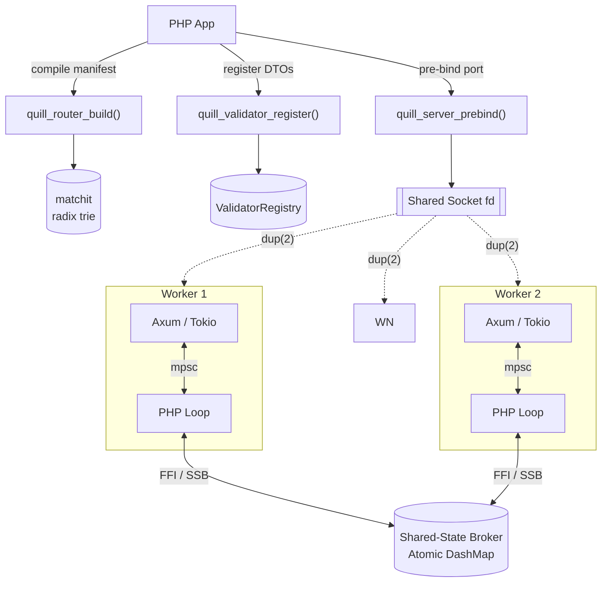
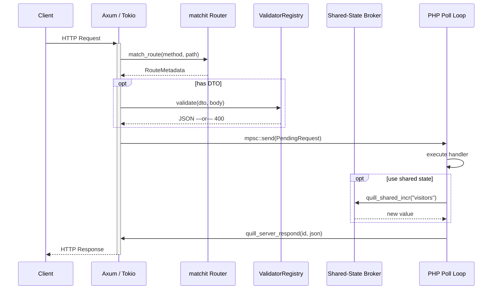

<div align="center">
  <h1>Quill-Core</h1>
  <p><strong>The high-performance native engine behind the Quill PHP Framework.</strong></p>

  [](https://github.com/quillphp/quill-core/actions/workflows/ci.yml)
  [](https://github.com/quillphp/quill-core/releases)
  [](https://www.rust-lang.org)
  [](LICENSE)
</div>

---

**Quill-Core** is the specialized native library that offloads heavy lifting from PHP userland to a thread-safe, memory-safe Rust engine. Built for sub-microsecond overhead, it powers the routing, validation, and shared-state management of the Quill PHP Framework.

## Key Features

- **Blazing Fast Routing**: Uses a Radix-tree based router (`matchit`) for O(1) matching in both PHP and CLI modes.
- **Shared-State Broker (SSB)**: A thread-safe, atomic Key-Value store shared across all PHP workers — no Redis required for simple state.
- **Native DTO Validation**: Decouples validation from PHP userland, performing schema checks at native speeds using the `validator` crate.
- **Ultra-Fast JSON**: Powered by `sonic-rs` for high-performance compaction and boundary-crossing transformations.
- **FFI-First & Hardened**: Seamlessly integrates via PHP `FFI` with robust null-pointer guards and memory safety.
- **Multi-Worker Ready**: Native support for pre-fork socket sharing (`dup(2)`).

---

## Architecture Overview

Quill Core owns the entire I/O stack. PHP never touches a socket — it only executes business logic, orchestrated by the native engine through a lock-free FFI bridge.

### Multi-Worker Model

The parent process compiles routes and pre-binds the TCP port **before** forking. Each child inherits the socket via `dup(2)` and independently initialises its own Rust runtime — while sharing a global **Shared-State Broker** (SSB) in the Rust heap.



### Request Lifecycle



---

## Shared-State Broker (SSB)

One of Quill-Core's most powerful features is the built-in **Shared-State Broker**. It provides a lock-free, thread-safe Key-Value store that lives in the Rust engine's memory space but is accessible from any PHP worker.

- **Atomic Operations**: Support for atomic increments/decrements (e.g., `quill_shared_incr`).
- **Low Latency**: Sub-microsecond access times compared to millisecond latencies of external stores like Redis.
- **Zero Configuration**: No separate service or configuration required.
- **Data Types**: Stores arbitrary JSON values, allowing for complex data sharing.

### Example Usage (via FFI)

```php
// Increment a global visitor count
$count = $ffi->quill_shared_incr("visitors", 11, 1);

// Store complex state
$ffi->quill_shared_set("session_1", 9, json_encode(['ip' => '127.0.0.1']), 18);

// Atomic key removal
$ffi->quill_shared_remove("session_1", 9);
```

---

## Installation

### Option 1: Using Pre-built Binaries (Recommended)
You can download the optimized shared libraries (`.so` or `.dylib`) and the required C-header (`quill.h`) directly from the [GitHub Releases](https://github.com/quillphp/quill-core/releases) page.

### Option 2: Building from Source
If you are contributing or need a custom build, you can compile from source using `cargo`:

```bash
# Clone the repository
git clone https://github.com/quillphp/quill-core.git
cd quill-core

# Build the shared library (bin/ folder)
./scripts/build.sh --release
```

---

## Integration with Quill PHP

By default, the Quill PHP framework will automatically discover the core library if it's placed in any of these locations:
1.  `build/libquill.so` (Local Development)
2.  `vendor/quillphp/quill-core/bin/libquill.so` (Composer Integration)
3.  `/usr/local/lib/libquill.so` (Global System Level)

You can override the discovery behavior using the **`QUILL_CORE_BINARY`** environment variable:

```bash
export QUILL_CORE_BINARY=/path/to/your/libquill.so
```

---

## Performance & Hardening

### Ultra-Fast JSON
Quill-Core uses **`sonic-rs`**, a SIMD-accelerated JSON library, to perform compaction and validation. This allows the core to process large payloads with minimal CPU cycles before passing them to PHP.

### FFI Hardening
The FFI boundary is designed for production stability:
- **Null-Pointer Guards**: Every C-string and pointer passed from PHP is checked for null before dereferencing.
- **Memory Safety**: Uses Rust's ownership model to ensure that memory allocated in the native engine is correctly managed and freed.
- **Thread Safety**: The Shared-State Broker uses `DashMap` (a concurrent hash map) to allow multiple PHP workers to read and write simultaneously without global locks.

---

## FFI API Reference

For developers building custom integrations, Quill-Core exports the following C-compatible functions:

### Router & JSON
- `quill_router_build(json, len)`: Compiles a JSON manifest into a Radix-tree.
- `quill_router_match(...)`: Matches a method/path and returns handler metadata.
- `quill_router_dispatch(...)`: High-level matching and DTO validation in one call.
- `quill_router_free(router)`: Frees a router instance.
- `quill_json_compact(input, len, out, max)`: SIMD-accelerated JSON compaction.

### Native Validator
- `quill_validator_new()`: Creates a new validator registry.
- `quill_validator_register(registry, name, n_len, schema, s_len)`: Registers a DTO schema.
- `quill_validator_validate(registry, name, n_len, input, i_len, out, max)`: Performs validation.
- `quill_validator_free(registry)`: Frees a validator instance.

### Shared-State Broker (SSB)
- `quill_shared_set(key, k_len, val_json, v_len)`: Store a JSON value.
- `quill_shared_get(key, k_len, out_buf, max)`: Retrieve a JSON value.
- `quill_shared_incr(key, k_len, delta)`: Atomic increment/decrement.
- `quill_shared_remove(key, k_len)`: Delete a key-value pair.
- `quill_shared_keys(out_buf, max)`: List all keys in the broker.

### Server
- `quill_server_prebind(port)`: Pre-bind a TCP socket (call before fork).
- `quill_server_listen(...)`: Start the Axum/Tokio worker thread.
- `quill_server_poll(...)`: Fetch the next pending request for PHP.
- `quill_server_respond(...)`: Send a response back to the native engine.

---

## Native DTO Validation

Quill-Core implements a powerful, low-latency validation engine in Rust. It supports rules like:

- **Type Safety**: `Numeric`, `Boolean`, `Regex`.
- **Consistency**: `Required`, `Email`, `Min`/`Max` (for numbers), `MinLength`/`MaxLength` (for strings).
- **Default Values**: Automatically inject default values for missing optional fields before they reach PHP.

By moving validation to the native layer, you reduce PHP CPU cycles and memory allocations for invalid requests.

---

## Development & Testing

We maintain strict code quality standards to ensure consistency and performance.

```bash
# Run unit tests
cargo test

# Run Clippy (linter)
cargo clippy -- -D warnings

# Apply formatting
cargo fmt --all
```

---

## License

This project is open-sourced under the **MIT License**.
